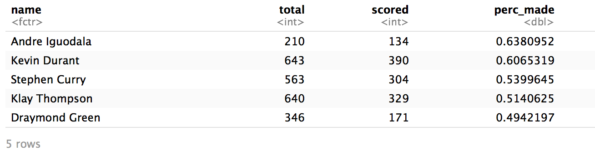
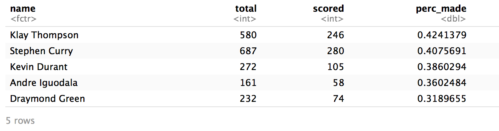
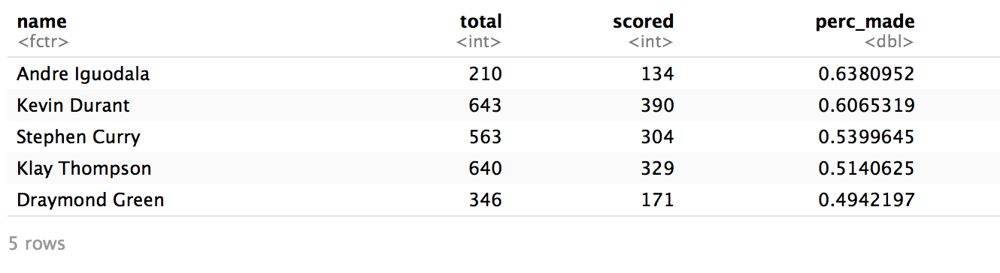

## **The Meterorical Rise of the Golden State Warriors**

#### **Introduction**
Hailed as one of the most popular basketball teams of all time, the Golden State Warriors are currently dominating the western conference tables. This report analyzes their meteoric rise by performing an in-depth analysis of the shooting percentages of their top players. 

#### **Methodology**
This report employs firstly employs graphics such as shot charts in order to analyse the performance of individual players. These shot charts comprise of scatterplots superimposed on an actual basketball court in order to better understand where these players scored from. For instance, colors have been used to differentiate when a players has scored a 3 pointer vs a 2 pointer. Additionally, we use facetted shot charts in order to give the readers an opportunity to compare the performance of players side by side. Another interesting tool that aided in our research was the inclusion of specific tables such as the  2PT effective shooting % per playe or the 3PT effective shooting % by player. This gives us an empirical way to compare the performance of players rather than getting influenced by bias. Our analysis also allowed us to make a judgement on who might be the most valuable player in the Golden State warriors. We based this solely on empricial evidence pertaining to the shooting percentages of individual players. This means that in particular we considered the efefctive shooting % by player. As a statistic, this essentially translates to the question **'From all the shots that a player took, how many were actaully successful?'**. This gives us an good way to measure the effectiveness of a player. 

#### **Code and Data used for Analaysis **

The data used for this analysis was open source, free data obtained NBA records about the shooting records of each player. This raw data was in the form of a csv file and was imported and analysed using the statistical and data analysis language R. The following code was used in order to generate the tables that will be used in the empirical analysis of the data 

```{r, include=TRUE, eval=FALSE}
temp5 <- read.csv('shots-datacopy.csv')

pt2gsw <- filter(temp5, shot_type =="2PT Field Goal")

pt3gsw <- filter(temp5, shot_type =="3PT Field Goal")

summary2pt <- arrange(summarise(group_by(pt2gsw, name), 
total = sum(shot_type == "2PT Field Goal"), scored = sum(shot_made_flag == "y"), perc_made = scored/total), desc(perc_made))


summary3pt <- arrange(summarise(group_by(pt3gsw, name), 
total = sum(shot_type == "3PT Field Goal"), scored = sum(shot_made_flag == "y"), perc_made = scored/total), desc(perc_made))


summary4 <- arrange(summarise(group_by(pt2gsw, name), 

                      total = sum(shot_type == "3PT Field Goal" | shot_type == "2PT Field Goal"), scored = sum(shot_made_flag == "y"), perc_made = scored/total), desc(perc_made))

png("summary.png", res = 56)
summary2pt
dev.off()

png("summary3.png", res = 56)
summary3pt
dev.off()


png("summary4.png", res = 56)
summary4
dev.off()
```

#### Analysis 


From the above **table of 2pt effective shooting percentages**, we can see that Iguodala is the most efficient player in terms of effective 2 points scored. From the table, we can see that Andre has made 63.8% of the 2 pointers that he has made. On the other hand, the worst player in terms of efficiency of 2 pointers is Draymond Green who has made less than 50% (49.4%) of the total shots that he has taken. Interestingly, in terms of volume, Durant has clearly taken the most shots - 643 since he is also the tallest player on the team.




From the above **table of 3pt effective shooting percentages**, we can see that Klay Thompson is the most efficient player in terms of effective 3 points scored. From the table, we can see that Andre has made 42.4% of the 3 pointers that he has made. On the other hand, the worst player in terms of efficiency of 3 pointers is Draymond Green who has made less than 50% (31.8%) of the total shots that he has taken. Interestingly, in terms of volume, Curry has clearly taken the most shots - 687 since he is considered the best 3 point shooter in the team.




From the above **table of overall effective shooting percentages by player**, we can see Iguodala is the most efficient player in terms of the overall shots taken (63.8%). And similarly, Draymond Green has the worst accuracy of 49.4%

#### ** Discussion **

The Golden State Warriors are coming off back to back off championships. And they have won three of the last four last championships. Ever since signing Kevin Durant, the Warriors have been consistent favorites for the NBA title. They are led by their leader Stephen Curry, who is arguably the best 3 point shooter in NBA history. Alongside Curry, is his splash brother Klay Thompson. Klay is one of the elite two-way players in the NBA today and is also arguably the second best 3 point shooter in NBA history. Their power forward Draymond Green brings the defensive intensity on a night in and night out basis. The Warriors are of the few elite teams in the NBA and will look to add more championship banners to their name.

#### ** Conclusion **

In my opinion Stephen Curry is the Warrior's best shooter and Kevin Durant is the Warriors best scorer. Although the data shows that Iguadala has a higher effective field goal percentage than Durant, Durant is clearly the better scorer as shown by the volume of shots he takes for the teams. Combined with his better midrange and 3 point shooting percentages, Durant is most definitely the Warriors most versatile and efficient scorer.

